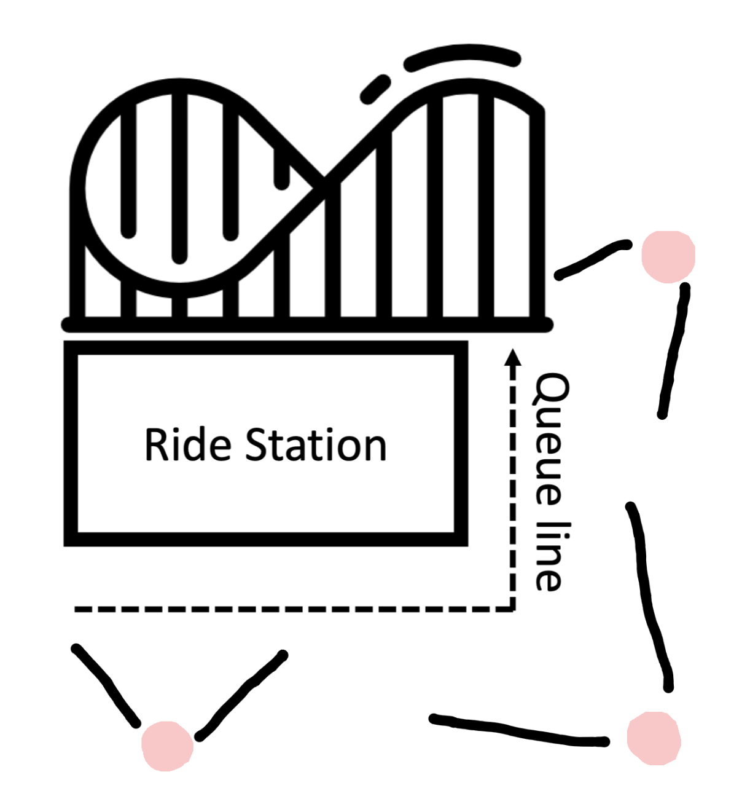

# Queue Waiting
[By Arun Singh Rawat, DongXu Liu, Luca Klingert, Sahar Moghtaderi, Prahas Hegde](https://github.com/Horizon-42/queue_waiting/tree/final)

## Task 1: Conceptualize the Camera Setup

Place the first camera at the beginning of the queue line, the third camera at the end, and the second camera in the middle. Position the second camera at an angle covering the corner to ensure no individual is missed.

## Task 2: Cross-Camera Person Tracking

### People Extraction

Use the YOLOv11 pretrained model to detect people in each frame from all camera views.

### Feature Extraction

Use the FastReID pretrained model to extract feature embeddings for each detected person in each frame.

### Tracking Within the Same Camera View

Compute the cosine similarity between feature vectors to match and track individuals within the same camera view.

### Multi-Camera Tracking

Apply the re-ranking algorithm to refine similarity scores across different camera views. Use these scores to match and merge identities of the same person across multiple cameras.

### Counting

After completing tracking, count the total number of unique individuals detected.

### Waiting Time Estimation

Each detected person is assigned an entry (in-line) and exit (out-line) frame index. Calculate the average waiting time using the difference between these two frame indices.

> Note: Frame index is used in place of real timestamps.

## Conclusion

Due to the limited accuracy of the pretrained models, especially in multi-camera matching, the system suffers from inaccuracies in both people counting and waiting time estimation.
